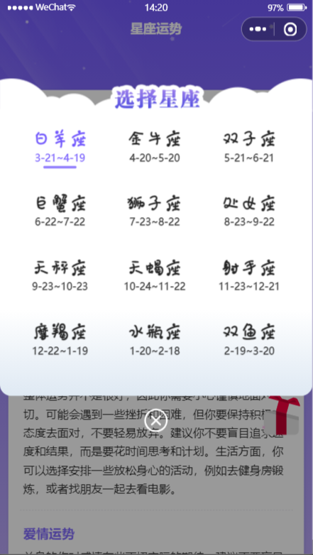

<div align=center> 
<p style="font-size:18px;color:#ccc">星座每日占（个人版小程序）</p>
</div>

## 扫码预览


## 简介

- **wx-mini-program** 是使用原生开发的微信小程序项目。无需安装任何插件，代码拉取后直接使用开发者工具打开即可成功运行。

- 不提供接口服务

- **欢迎提 Bug,如有新的需求和想法，欢迎 issue**

## 页面展示



## 其他

### 引入 iconfont 多色图标

使用示例 [原博](https://blog.csdn.net/Simoral/article/details/103804310)

```
<iconfont name="A" size="38" />

npm install mini-program-iconfont-cli --save-dev
npx iconfont-init
npx iconfont-wechat
```

### 字体压缩

> 在某些模块需要使用特定的字体，当字体包过大时就会存在压缩的需求
>
> 压缩需要的文字使用 font-spider 插件
>
> 然后使用[字体转 base64](https://transfonter.org/)

## MIT 许可协议

[MIT](./LICENSE)

## 声明

本项目仅做技术交流和学习，不建议用于商业目的！
